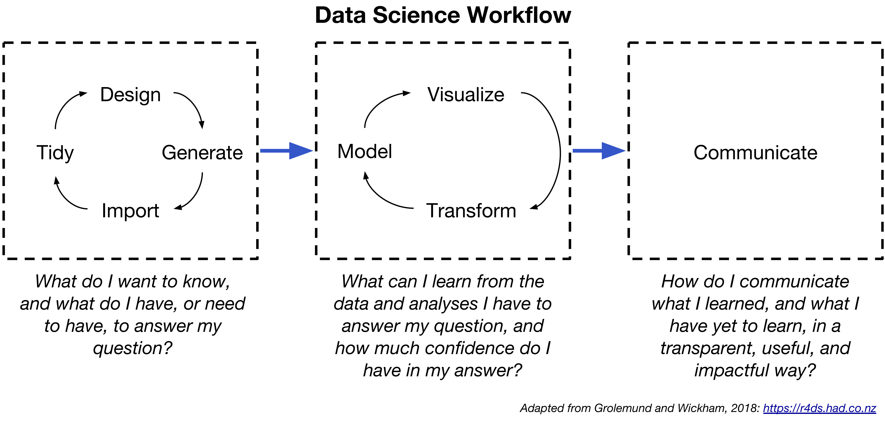

```{r setup, include=FALSE}
knitr::opts_chunk$set(echo = TRUE, warning = FALSE, message = FALSE)
```

### Course Purpose

<center>
*Learn from your data, but your data should not be your teacher.* ~ Rex Kline
</center>

<br>

Statistics is not a subject that many students long to take. Many of you may have already had a statistics course as an undergraduate that, to put it politely, left you dissatisfied (as in you could not wait for the class to be over!).  

If that’s the case, I’m hoping that you have a different experience in this class.

I am passionate about data science and its power to enhance decision making in organizations---and in your personal life, for that matter. While there is growing interest and recognition in the power of data science for business, and a commensurate growth of tools available to conduct large scale analysis, the fundamentals of applied statistics remain much the same as they have been for decades. This is our focus---learning the fundamentals that apply whether you are looking at a correlation or a negative binomial regression. More importantly though, we'll be talking about how to best integrate data science into your decision making, how to be a better consumer of statistical analysis products, and how to better manage research and data science projects.  This is a foundations course, and one that will provide a valuable knowledge base during your time at Bloch and beyond. 

The underlying goal of a good data science course is to improve your ability to think statistically. Our specific goal is to understand probability, to identify meaningful questions, to tease out potential solutions to these problems, and to use those insights to make better decisions and predictions. This is fundamentally a dynamic process that unfolds under uncertainty---there will always be an element of randomness to our analyses and to how the world unfolds around us. That means data science has more than a little ‘art’ to its (useful) practice!

If you are willing to be a little uncomfortable, if you are willing to accept that statistics is not as black and white as you might think, and if you are willing to think a little more like a scientist when you approach data and analyses, then I believe this will be one of the funnest courses of your tenure at the Bloch School.

<center>
*The data may not contain the answer. The combination of some data and an aching desire for an answer does not ensure that a reasonable answer can be extracted from a given body of data.* ~ John Tukey
</center>

<br>

#### Learning Objectives

| Executive MBA SLOs | DSOM 5509 SLOs |
|:-------------------------------|:-------------------------------|
| **Strategic Perspective and Business Acumen:** Students will apply strategic frameworks to complex business issues and identify viable options and forward-looking strategies, through the integrated analysis of multiple functional perspectives – e.g. marketing, product development/service delivery, finance, operations and human capital. | Students will demonstrate sound reasoning and effective decision making through the use of statistical methods, tools, and analytical thinking. |
| **Public Policy Awareness:** Students will demonstrate enhanced understanding of complex public sector systems, processes and leaders, and identify and define the various forces that shape and impact business policy. |  |
| **Innovative Mindset:** Students will demonstrate the skills needed to generate creative solutions that address unmet needs and wants, evaluate the relative attractiveness of competing solutions, and organize to exploit opportunities in the marketplace. | Students will apply statistical and analytical methods to resolve issues and approach new business opportunities. |
| **Global Perspective:** Students will utilize a knowledge framework to 1) critically think about and assess the impact and linkage of global influences, issues, trends, and decisions in business models; and 2) demonstrate insight and agility in operating within a global business environment. |  |
| **Teamwork:** Students will demonstrate the communication and interpersonal skills needed for effective collaboration and creative problem-solving, as well as the versatility to add value in a variety of team roles – leader, expert, facilitator, etc. | Students will demonstrate their ability to collectively and collaboratively research, present and solve business issues, while using data and statistical thought to identify business opportunities. |
| **Strategic Leadership:** Students will demonstrate the ability to 1) diagnose complex business situations, recognizing key issues, tensions and dilemmas; and 2) articulate decisions and action plans that reflect comprehensive understanding of the human, political, and cultural context as well as nuanced ways of building influence and support. | Students will demonstrate their understanding of applying data and analytics to the strategic planning process. |

#### Format

This is not a traditional lecture-based course. I use a modified version of the ‘flipped classroom’ format, which means that you will read blog posts, academic papers, watch videos, and complete an assessment exercise before each class session. During class we will focus on solving a problem or problems using cases, exercises, team activities, additional assessments, and an open discussion. Success in this course is a function of your engagement. I cannot stress this point enough---you must engage with the material and with your peers. Data science is a contact sport. You must come to each and every session prepared and ready to contribute!

<br>

***

### Course Materials

You can find links to all required videos and readings below. I've noted the readings that require you to be on campus, logged in to the [UMKC VPN](http://www.umkc.edu/is/support/services/VPN/), or by logging on to the [UMKC Library](https://library.umkc.edu/mnl). 

We will be using [R](https://cran.r-project.org) and [R Studio](https://www.rstudio.com) in this course. There is no software for you to install fortunately, because we are using a new platform called [R Studio Cloud](https://rstudio.cloud/). R Studio Cloud is a alpha-version product, but I have been using and teaching with it for some time and found it to be highly reliable. In addition to delivering R over a web browser, it has features that make it easy to share and deliver individual and team work. For this class you will need a laptop with an up-to-date browser, but platform (Mac or Windows) or browser type (Safari, Chrome, Edge, etc) does not matter. 

In addition to the required material, below are a few resources I recommend to learn more about data science, business analytics, and learning R.

#### Books

* [R for Data Science -- Open Access](http://r4ds.had.co.nz)
* [Data Visualization for Social Science -- Open Access](http://socviz.co)
* Angrist J, Pischke J-S. 2008. Mostly Harmless Econometrics: An Empiricist’s Companion. Princeton University Press: Princeton, NJ.
* Kline, R.B., 2015. Principles and Practice of Structural Equation Modeling, Fourth Ed. Guilford Publications, New York.
* Pearl, J., 2018. The Book of Why: The New Science of Cause and Effect. Basic Books, New York.
* Pearl, J., 2009. Causality: Models, Reasoning, and Inference, 2nd Ed. Cambridge University Press, New York.

#### Blogs

* [Mine!](https://www.drbanderson.com)
* [Freakonomics](http://freakonomics.com)
* [FiveThirtyEight](https://fivethirtyeight.com)
* [Andrew Gelman's Blog](http://andrewgelman.com)
* [Simply Statistics](http://simplystatistics.org)
* [DataColada](http://datacolada.org)

#### Learning R and R Studio 

* [R Studio Primers](https://rstudio.cloud/learn/primers)
* [DataCamp](https://www.datacamp.com/)
* [Learning R Markdown](https://rmarkdown.rstudio.com/lesson-1.html)
* [Tidyverse style guide](https://style.tidyverse.org)
* [R Syntax Comparison Cheatsheet](http://www.science.smith.edu/~amcnamara/Syntax-cheatsheet.pdf)
* [How to use the rstanarm package](https://cran.r-project.org/web/packages/rstanarm/vignettes/rstanarm.html)

<br>

***

### Course Schedule

<center>

</center>

<br>

Each course session touches on the entire data science workflow shown in the graphic, but will emphasize one specific area. Over the course, you should become comfortable with this workflow and be able to use it in future data science projects. 

<br>

#### Session 1: 4 Jan 2019

**Generating Data & Asking Good Questions**

*Readings*

* [Constructing a Data Analysis](https://simplystatistics.org/2018/08/24/constructing-a-data-analysis/)
* [Creativity in Data Analysis](https://simplystatistics.org/2018/06/26/creativity/)
* [More Evidence That Nutrition Studies Don’t Always Add Up](https://www.nytimes.com/2018/09/29/sunday-review/cornell-food-scientist-wansink-misconduct.html)
* [Stitch Fix Algorithms Tour](https://algorithms-tour.stitchfix.com)
* [What’s in a Name?](https://eng.lyft.com/whats-in-a-name-ce42f419d16c)
* [Why You’re Not Getting Value from Your Data Science](https://hbr.org/2016/12/why-youre-not-getting-value-from-your-data-science)

*Videos*

* [Course introduction](https://youtu.be/LYGdEfQNKNw)
* [Working in R Studio Cloud](https://youtu.be/lFximWuEaPw)

<br>

#### Session 2: 26 Jan 2019

**Measures, Proxies, Constructs & Measurement Error**

*Readings* 

* [Partitioning the Variation in Data](https://simplystatistics.org/2018/07/23/partitioning-the-variation-in-data/)
* [Scientific Debt](http://varianceexplained.org/r/scientific-debt/)
* [Measurement Error as an Endogeneity Problem](https://www.drbanderson.com/2017/07/14/measurement-error-as-an-endogeneity-problem/)
* [That Pesky (Cronbach's) Alpha](https://www.drbanderson.com/2017/09/19/that-pesky-cronbach-s-alpha/)

*Videos* 

* [Different ways of measuring the same thing](https://youtu.be/h4aVcxJgOqo)

<br>

#### Session 3: 8 Feb 2019

**Data Wrangling**

*Readings*

* [How to Share Data for Collaboration](https://peerj.com/preprints/3139.pdf)
* [Tidy Data](https://www.drbanderson.com/2017/11/09/tidy-data/)
* [Data Wrangling](https://www.drbanderson.com/2018/01/26/data-wrangling/)

*Videos*

* [Data wrangling with the tidyverse](https://youtu.be/7mU7khywBGM)

<br>

#### Session 4: 23 Feb 2019

**Making Causal Claims & Predicting the Future**

*Readings*

* [Guidelines For AB Testing](http://hookedondata.org/Guidelines-for-AB-Testing/)
* [Why ask Why? Forward Causal Inference and Reverse Causal Questions](http://www.stat.columbia.edu/~gelman/research/unpublished/reversecausal_13oct05.pdf)
* [Establishing a Causal Relationship is Hard](https://www.drbanderson.com/2018/09/06/establishing-a-causal-relationship-is-hard-evaluating-a-causal-claim-isn-t-as-difficult/)

*Videos*

* [Evaluating regression models](https://youtu.be/UfgbdtAEwNI)

<br>

#### Session 5: 8 March 2019

**Constructing a Narrative**

*Readings*

* [The Benefits of Reproducible Workflows](https://andrewgelman.com/2014/09/19/never-happened-r-markdown/)
* [Trustworthy Data Analysis](https://simplystatistics.org/2018/06/04/trustworthy-data-analysis/)
* [Prioritizing Data Science Work](https://towardsdatascience.com/prioritizing-data-science-work-936b3765fd45)
* [Relationships in Data Analysis](https://simplystatistics.org/2018/04/30/relationships-in-data-analysis/)

*Videos*

* [Constructing visualizations with ggplot2](https://youtu.be/ty9F2F3AnnU)

<br>

#### Session 6: 23 March 2019

**Multilevel Modeling**

*Readings*

* [Multilevel Modeling](https://www.drbanderson.com/2018/05/04/multilevel-modeling/)
* [Crawling the Internet: Data Science within a Large Engineering System](http://www.unofficialgoogledatascience.com/2018/07/by-bill-richoux-critical-decisions-are.html?m=1)
* [What is a Successful Data Analysis?](https://simplystatistics.org/2018/04/17/what-is-a-successful-data-analysis/)
* [The Tentpoles of Data Science](https://simplystatistics.org/2019/01/18/the-tentpoles-of-data-science/)
* [Visualizing Panel Data](https://www.drbanderson.com/2017/10/03/visualizing-panel-data/)

*Videos*

* [The basics of working with multilevel data](https://youtu.be/Lxuig_L1TT4)

<br>

***

### Assessment

#### Assessment Breakdown

* Individual Assessments: 30% (6 X 5pts)
* Team Deliverables: 60% (6 x 10pts)
* Individual Paper: 10% (1 x 10pts)

<br>

#### Individual Assessments

You will complete an individual assessment before each class period. These are typically completion-based assessments, but they *must* be completed before our session. You will find the assessments in our RStudio.cloud workspace, and please note that I will typically release RStudio.cloud workspaces sequentially---I release the workspace for session 2 after we complete session 1.

<br>

#### Team Deliverables

Your team will complete a deliverable during each class session. Typically these deliverables involve writing up the results of an analysis project we completed in class. I provide these deliverables at the start of each class session, along with a grading rubric. 

<br>

#### Individual Paper

You will write a 3-4 page reflection paper due one week after the conclusion of the course addressing three questions: 1) What surprised you most about the course; 2) What challenged you the most in the course; and 3) How would you improve the course for future students. 

<br>

#### Grading Scale

-------------------------------------------------------------
Grade  Evaluation         Min. Percent
------ ------------------ ------------
A      Superior/Excellent 93

A-                        90

B+                        87

B      Good/Above Average 83

B-                        80

C+                        77

C      Competent/Average  73

C-                        70

D+                        67

D      Minimum Passing    63

D-                        60

F      Failing            <60
-------------------------------------------------------------

<br>

***

### Course Logistics

| About the... | Details... |
|:---------------|:-------------------------------------------------------|
| Class Sessions | [EMBA course calendar](https://bloch3.umkc.edu/wp-content/uploads/2018/03/Recruiting-Calendar.pdf) | 
| Office Hours | Please contact me for an appointment: andersonbri@umkc.edu or (p) 816.235.2316. My office is BEH 321. |
| Catalog Info | DSOM 5509---Applied Statistical Methods |
| Credit Hours | 2 |
| Prerequisites | Student must be enrolled in the Executive MBA program and in good academic standing. |
| Restrictions | This class is not open to students who are not enrolled in the Executive MBA program. |
| Course Format | Recitation/seminar/discussion | 
| Instructional Mode | Classroom based |
  
<br>

***

### UMKC Support Services

| Topic... | Services... |
|:---------------|:-------------------------------------------------------|
| Technology Support | [Online](https://www.umkc.edu/IS/comments_or_problems.asp), [Helpdesk Chat](https://home-c6.incontact.com/inContact/ChatClient/ChatClientPatron.aspx?poc=f82230de-b694-4fa2-9678-febda492d489&bu=4593164), (p) 816.235.6700, email: callcenter@umkc.edu |
| UMKC Alert | [Sign up for the UMKC Alert Emergency Information Center](https://www.umkc.edu/umkcalert/default.asp) to receive real-time updates on severe weather, medical emergency, fire, chemical spill, evacuation, unauthorized persons, police emergency, radioactive release, flood, earthquake, tornado warning, bomb threat, and active shooter. |
| Police Department | The fundamental mission of the University Police force is to provide the leadership and professional support required to sustain and improve the University System’s efforts to develop a balanced police-University community effort against any lawlessness or disorderly conduct which could interfere with the general missions of the University System. As such, the [UMKC Police Department](https://www.umkc.edu/finadmin/police/default.asp) is an essential university partner promoting a safe and orderly learning environment and enhanced quality of life with a reduction of crime, social disorder and fear of crime. |
| Disability Services | To obtain disability related accommodations and/or auxiliary aids, students with disabilities must contact the [Office of Services for Students with Disabilities](https://info.umkc.edu/disability-services/) (OSSD) as soon as possible. To contact OSSD, call (816) 235-5696 or email at disability@umkc.edu. You may also visit the office in-person at 5110 Oak Street, Suite 225, Monday-Friday from 8:30-5:00. Once verified, OSSD will notify the course instructor and outline the accommodation and/or auxiliary aids to be provided. |

<br>

***

### Classroom Policies

| Topic... | Policy... |
|:---------------|:-------------------------------------------------------|
| Syllabus Changes | While it is my intention to adhere to the class-by-class schedule and list of deliverables set forth in in the syllabus, I reserve the right to make changes for pedagogical or other compelling reasons.  Any significant changes will be announced in class, sent over UMKC email, and in this syllabus. |
| UMKC Mission | UMKC’s mission is to lead in life and health sciences; to deepen and expand strength in the visual and performing arts; to develop a professional workforce and collaborate in urban issues and education; and to create a vibrant learning and campus life experience. |
| Academic Honesty | The Board of Curators of the University of Missouri recognizes that academic honesty is essential for the intellectual life of the University. Faculty members have a special obligation to expect high standards of academic honesty in all student work. Students have a special obligation to adhere to such standards. Academic dishonesty, including cheating, plagiarism or sabotage, is adjudicated through the [University of Missouri Student Conduct Code](http://www.umsystem.edu/ums/rules/collected_rules/programs/ch200) and [Rules of Procedures in Student Conduct Matters](https://www.umsystem.edu/ums/rules/collected_rules/programs/ch200/200.020_rules_of_procedures_in_student_conduct_matters). The University of Missouri outlines Student Conduct expectations and sanctions for violations, including academic dishonesty (like plagiarism and cheating).  For more information see: [University of Missouri Student Conduct Code.](http://www.umsystem.edu/ums/rules/collected_rules/programs/ch200/200.010_standard_of_conduct) |
| Academic Calendar | The University has very specific guidelines on withdrawing from classes.  There are important financial and assessment implications of trying to drop a course after the deadline. You can find registration, drop, and withdrawal dates through the [Registrar’s Registration and Records website.](https://www.umkc.edu/Registrar/registration/registration-dates.asp) |
| Academic Inquiry, Course Discussion, and Privacy | University of Missouri System Executive Order No. 38 lays out principles regarding the sanctity of classroom discussions at the university. The policy is described fully in Section 200.015 of the Collected Rules and Regulations. In this class, students may make audio or video recordings of course activity unless specifically prohibited by the faculty member. However, the redistribution of any audio or video recordings of statements or comments from the course to individuals who are not students in the course is prohibited without the express permission of the faculty member and of any students who are recorded, including those recordings prepared by an instructor. Students found to have violated this policy are subject to discipline in accordance with provisions of Section 200.020 of the Collected Rules and Regulations of the University of Missouri pertaining to student conduct matters. |
| Attendance Policy | Students are expected to attend and participate in classes and lab sessions. **Given the unique nature of the EMBA program, missing a class or lab session should occur in emergency situations only.** |
| English Proficiency Statement | Students who encounter difficulty in their courses because of the English proficiency of their instructors should speak directly to their instructors. If additional assistance is needed, they may contact the UMKC Help Line at 816-235-2222 for assistance. |
| Grade Appeal Policy | Students are responsible for meeting the standards of academic performance established for each course in which they are enrolled. The establishment of the criteria for grades and the evaluation of student academic performance are the responsibilities of the instructor. This grade appeal procedure is available only for the review of allegedly capricious grading and not for review of the instructor's evaluation of the student's academic performance. Capricious grading, as that term is used here, comprises any of the following: a) The assignment of a grade to a particular student on some basis other than the performance in the course; b) The assignment of a grade to a particular student according to more exacting or demanding standards than were applied to other students in the course; (Note: Additional or different grading criteria may be applied to graduate students enrolled for graduate credit in 300- and 400-level courses.); c) The assignment of a grade by a substantial departure from the instructor's previously announced standards. |
| Grievance procedures | The University will promptly and appropriately respond to any complaint of violation of the University’s anti-discrimination policies. [The procedures described in the UM System Rules and Regulations](https://www.umsystem.edu/ums/rules/collected_rules/equal_employment_educational_opportunity/ch600) apply to such complaints. |
| Notice of Non-Discrimination | UMKC does not discriminate on the basis of race, color, ethnic or national origin, sex, sexual orientation, gender identity, religion, age, ancestry, disability, military status, veteran status, in admissions, educational programs or activities and employment. The University complies with all federal and state laws and [University of Missouri Statement of Nondiscrimination](https://missouri.edu/statements/eeo-aa.php) including Title IX of the Education Amendments of 1972, Section 504 of the rehabilitation Act of 1973, Title VII of the Civil Rights Act of 1964 and the state of Missouri Human Rights Act Chapter 213 RSMO. |
| Sex Discrimination, Harassment, and Assault | [Title IX of the Education Amendments of 1972](https://info.umkc.edu/title9/about/) is a federal law that prohibits sex discrimination in education. It reads, “No person in the United States shall, on the basis of sex, be excluded from participation in, be denied the benefits of, or be subjected to discrimination under any education program or activity receiving Federal Financial Assistance” -Title IX of the Education Amendments of 1972, and its implementing regulations at 34 C. F. R. Part 106. Sex discrimination includes sexual harassment, assault, and/or violence. Title IX is often thought of as the law that applies to athletic programs, Title IX is much broader than Athletics and applies to all programs at UMKC. While compliance with the law is everyone’s responsibility at UMKC, you can find a list of staff members below who have primary responsibility for Title IX compliance. |
| Statement of Human Rights | The Board of Curators and UMKC are committed to the policy of equal opportunity, regardless of race, color, religion, sex, sexual orientation, national origin, age, disability and status as a Vietnam era veteran. Commitment to the policy is mentored by the [Division of Diversity, Access & Equity](https://www.umkc.edu/diversity/), but it is the responsibility of the entire university community to provide equal opportunity through relevant practices, initiatives and programs. |
  
<br>

***
<center>
*Three statisticians go hunting. The first one shoots, and misses far right. The second one shoots, and misses far left. The third one says, "we got it!"*
</center>

***
<small>
<center>
Brian S. Anderson, Ph.D. | Associate Professor of Entrepreneurship | andersonbri@umkc.edu  
Henry W. Bloch School of Management | University of Missouri - Kansas City  
**[entrepreneurship.bloch.umkc.edu](http://www.entrepreneurship.bloch.umkc.edu)**
</center>
</small>

